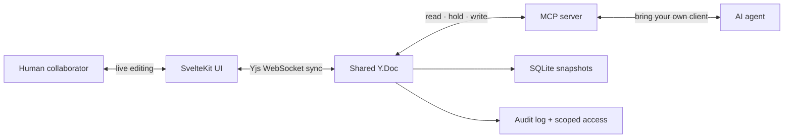

<p align="center">
  
</p>

<h1 align="center">Compendium</h1>

<p align="center">
  <strong>Where people and AI agents build knowledge together.</strong>
</p>

<p align="center">
  An open-source, real-time knowledge workspace where humans and MCP-compatible
  agents read and write the same documents, tables, boards, and calendars.
  Nothing to copy, paste, export, or reconcile.
</p>

<p align="center">
  <a href="https://github.com/brylie/compendium/actions/workflows/ci.yml"></a>
  <a href="LICENSE"></a>
  <a href="docs/specifications/mcp-tools.md"></a>
  <a href="https://svelte.dev"></a>
</p>

> **Project status:** Compendium is an actively developed personal MVP. The
> human–agent collaboration loop works today; multi-tenant authentication and
> production hardening are still on the roadmap.

## The idea

Most knowledge tools give an AI a chat box beside your work. The agent can
suggest a page, summarize a page, or generate a replacement—but the handoff
back into the real source of truth is still yours to manage.

Compendium starts from a different premise: **an agent should collaborate in
the workspace, not comment from the sidelines.**

A person editing in the browser and an agent connected over the Model Context
Protocol operate on the same live records. Both can read structure, make
changes, follow links, update tables, and see each other's work arrive in real
time. Agent access is scoped, edits are attributed, and active work is
coordinated at the block level.



One workspace. One data model. Two kinds of collaborators.

## What makes Compendium different

### Agents work on the real thing

Claude, ChatGPT, Gemini, or a custom MCP client can work directly with the
same Documents and Collections visible in the UI. There is no agent-only copy
and no import/export seam where context or attribution gets lost.

### Documents and structured work share one model

A paragraph, heading, task row, and board card are all addressable workspace
records. Documents provide narrative; Collections provide structure; Table,
Board, and Calendar are views over the same Collection data. Agents do not
need a different protocol for every surface.

### Collaboration is explicit

Before replacing existing content, an agent holds the blocks it intends to
change. People can see that work in progress, conflicting blocks are rejected
individually, and abandoned holds expire automatically. Humans remain in
control without reducing agents to read-only assistants.

### Trust is part of the architecture

Access tokens are scoped to specific Documents and Collections. Writes,
deletes, and denied attempts are attributed in an audit log. The collaboration
contract is tested across real MCP, HTTP, WebSocket, and browser boundaries—not
only as isolated functions.

## Available today

| Capability                      | What works now                                                                                                  |
| ------------------------------- | --------------------------------------------------------------------------------------------------------------- |
| **Document editor**             | Rich text, block types, slash commands, a persistent toolbar, nested pages, and local undo/redo                 |
| **Structured data**             | Collections with schemas and editable Table, Board, and Calendar views, including inline views inside Documents |
| **Connected knowledge**         | Stable page links, `[[wiki links]]`, explicit broken-link states, and live backlinks                            |
| **Agent access**                | An MCP server for listing, reading, creating, moving, searching, and editing workspace content                  |
| **Live coordination**           | Yjs synchronization, human presence, per-block agent holds, and conflict-safe writes                            |
| **Permissions and attribution** | Document/Collection-scoped tokens, actor attribution, and a queryable audit log                                 |
| **Persistence**                 | SQLite-backed CRDT snapshots, access tokens, and audit history                                                  |

The [product requirements](docs/prd.md) explain the larger thesis. The
[canonical specifications](docs/specifications/) describe exactly what is
implemented and where the boundaries still are.

## See the collaboration loop

1. A person creates a planning Document and a task Collection in the browser.
2. An MCP agent reads both as structured workspace records—not as a flattened
   export.
3. The agent holds the blocks it plans to update; the UI shows that activity.
4. The agent updates the plan and task rows. Open clients receive the changes
   immediately.
5. The audit log records who changed what, while the human's own concurrent
   edits remain protected.

That loop is the product: durable knowledge shaped jointly by people and
agents, in the place where the work already lives.

## Quick start

Compendium's CI runs on Node.js 24.

```sh
git clone https://github.com/brylie/compendium.git
cd compendium
npm install
npm run dev
```

Open [http://localhost:5173](http://localhost:5173). The development server
hosts the web UI, Yjs WebSocket endpoint, and MCP endpoint together.

For a production-style local build:

```sh
npm run build
ORIGIN=http://localhost:3000 npm start
```

> Compendium is currently a single-tenant, local-trust MVP. Do not expose it
> to an untrusted network as though it already had multi-user authentication.

## Connect an AI client

1. Create a Document or Collection in Compendium.
2. Open **Tokens** at `/settings/tokens` and create a token scoped to the
   content the agent should access.
3. Configure a locally running desktop MCP client, such as Claude Desktop,
   with that token as a Bearer token. Use `http://localhost:5173/mcp` with
   `npm run dev`, or `http://localhost:3000/mcp` with the default `npm start`
   configuration (use the matching port if you set `PORT`). Cloud-hosted chat
   clients cannot reach `localhost`; connecting them or exposing Compendium
   through a public tunnel is outside this local-first prototype's scope.
4. Keep the browser open and ask the agent to list Documents, read one, hold a
   block, and update it. The result appears live in the editor.

The MCP surface currently includes:

```text
list_documents    get_document      create_document
move_document     delete_document   list_collections
query_collection  search_workspace  hold_records
release_records   create_record     write_record
delete_record
```

See the [MCP tool contract](docs/specifications/mcp-tools.md) for inputs,
outputs, permissions, and link behavior.

## Architecture

Compendium deliberately runs the UI sync endpoint, MCP server, and persistence
layer in one Node process. They resolve the same in-memory Yjs workspace, so an
MCP write and a browser edit converge without polling or a second application
data model.

- **SvelteKit + Svelte 5** provide the application and editor UI.
- **Yjs + y-websocket** provide CRDT state and real-time synchronization.
- **MCP** gives compatible agents structured read/write access.
- **SQLite + Drizzle** store snapshots, scoped tokens, and the audit log.
- **Vitest + Playwright** verify business logic and real protocol convergence.

Read the [architecture specification](docs/specifications/architecture.md) for
the process model and the [data-model specification](docs/specifications/data-model.md)
for the shared record primitive.

## Development

```sh
npm run test          # unit and component tests
npm run test:integration # real HTTP/WebSocket protocol tests (Tier A + transport isolation)
npm run test:e2e      # protocol integration plus browser-level flows
npm run benchmark:workspace        # bounded CRDT capacity profile
npm run benchmark:workspace:large  # manual sharding/persistence profile
npm run check         # Svelte and TypeScript checks
npm run lint          # formatting and lint rules
npm run build         # production build
```

The E2E suites intentionally cross real transport boundaries. A feature is not
considered integrated merely because its UI and service functions pass in
isolation.

The capacity benchmark is intentionally separate from routine tests so it can
measure a real temporary SQLite + WebSocket + MCP workspace without making
ordinary checks environment-sensitive. Run the bounded profile for CRDT,
sync, snapshot, or routing changes; run both profiles before and after
shard-aware routing, catalog/SSE integration, compaction, snapshot-format,
persistence, or sync-protocol redesign. See the [testing strategy](docs/specifications/e2e-testing.md#6-capacity-benchmark--crdt-and-sharding-regression-gate)
for the canonical selection rules and the [current baseline](docs/benchmarks/crdt-capacity-baseline-2026-08-30.md).

## Roadmap

The [Compendium project board](https://github.com/users/brylie/projects/6) is
the canonical roadmap. Near-term work focuses on daily-driver editor depth,
workspace search, multi-space organization, stronger agent parity, and
scalable persistence. Longer-term possibilities include a relationship graph,
workflow automation, and multi-agent handoffs.

Browse the [open issues](https://github.com/brylie/compendium/issues) to see
what is ready, in progress, and deliberately deferred.

## Documentation

- [Changelog](CHANGELOG.md)—release history and notable changes
- [Product requirements](docs/prd.md)—the problem, product bet, boundaries,
  and phased roadmap
- [Specifications index](docs/specifications/README.md)—canonical behavior by
  subsystem
- [Architecture](docs/specifications/architecture.md)—process, routes, and
  synchronization model
- [MCP tools](docs/specifications/mcp-tools.md)—the agent-facing contract
- [Collaboration](docs/specifications/collaboration.md)—presence and block
  holds
- [Internal links](docs/specifications/internal-links.md)—stable links,
  broken targets, and backlinks
- [Testing strategy](docs/specifications/e2e-testing.md)—why protocol-level
  convergence is tested

## License

Compendium is licensed under the [Apache License 2.0](LICENSE).
